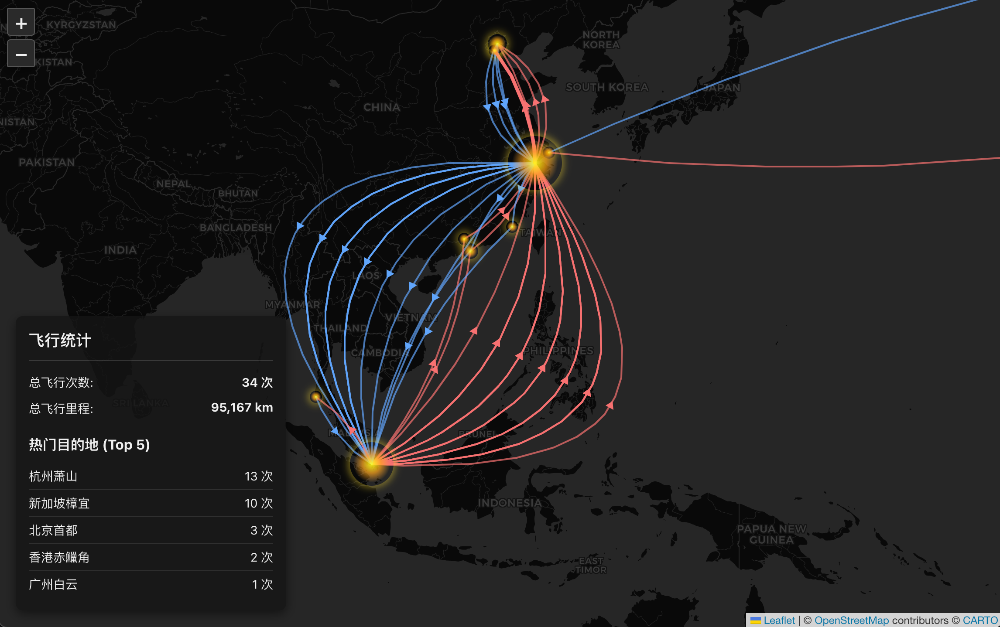

# Flight Path Chronicle (飞行轨迹纪事)

一个交互式的 Web 应用，旨在以优雅和信息丰富的方式，将您的历史飞行轨迹可视化在世界地图上。本项目灵感来源于“航旅纵横”，并在此基础上进行了功能和视觉的优化。



---

## ✨ 功能特性

### 🌏 交互式世界地图
- **沉浸式体验**: 基于 **Leaflet.js** 构建，提供流畅的缩放和平移体验。
- **太平洋中心视图**: 优化地图中心点，完美展示跨太平洋航线（亚洲在左，美洲在右），支持无缝水平滚动。
- **自适应深色模式**: 自动跟随系统主题，提供舒适的视觉体验。

### ✈️ 智能航线绘制
- **往返航线区分**: 自动识别去程（纬度/经度增加）和返程航线，以红/蓝双色直观区分。
- **贝塞尔曲线路径**: 拒绝生硬的直线，使用优美的贝塞尔曲线绘制每一条航线。
- **动态曲率计算**: 
  - 智能处理多频次飞行，当两地间存在多条航线时，自动计算不同曲率，形成优雅的平行弧线，避免重叠。
  - 曲线顶点根据地图投影动态计算，确保视觉上的对称与平衡。

### 📊 数据可视化与统计
- **机场辉光高亮**: 
  - 机场节点以黄色辉光圆点呈现。
  - **动态大小**: 圆点大小与机场起降次数正比，直观展示繁忙程度。
  - **独立图层**: 机场层置顶渲染，确保不被密集航线遮挡。
- **悬浮统计面板**: 实时展示关键数据：
  - 总飞行次数
  - 总飞行里程（公里）
  - Top 5 最常访问机场排行

### ⏱️ 时光回溯（Timeline）
- **飞行轨迹回放**: 内置时间轴控制器，支持播放/暂停。
- **时间筛选**: 可通过拖动滑块查看特定时间点之前的飞行记录，重温飞行历史。

---

## 🛠️ 技术栈

- **前端框架**: [Next.js 16](https://nextjs.org/) (React 19)
- **语言**: [TypeScript](https://www.typescriptlang.org/)
- **地图库**: [Leaflet](https://leafletjs.com/) & [React-Leaflet](https://react-leaflet.js.org/)
- **样式**: Tailwind CSS (v4)
- **代码规范**: ESLint + Jest (单元测试)

---

## 🚀 本地运行

1.  **克隆仓库**:
    ```bash
    git clone https://github.com/netbeen/flight-path-chronicle.git
    cd flight-path-chronicle
    ```

2.  **安装依赖**:
    ```bash
    npm install
    ```

3.  **启动开发服务器**:
    ```bash
    npm run dev
    ```

4.  在浏览器中打开 `http://localhost:3000` 查看项目。

---

## 🧪 测试与构建

项目集成了代码规范检查和单元测试：

- **运行 Lint**: `npm run lint`
- **运行测试**: `npm run test`
- **构建项目**: `npm run build` (会自动执行 lint 和 test)
